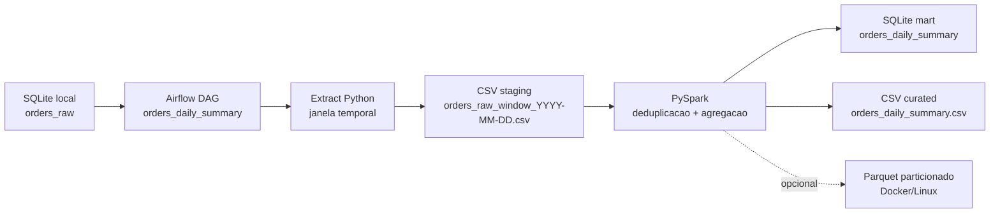

# Verity Data Engineer Challenge

Pipeline local com Apache Airflow, Python e PySpark para processar uma tabela transacional `orders_raw`, tratar registros tardios e duplicados, e gerar uma visao analitica consolidada.

## Arquitetura



## Decisoes tecnicas

O pipeline usa uma janela temporal inclusiva baseada em `process_date` e `lookback_days`. Para `process_date=2026-03-16` e `lookback_days=2`, por exemplo, a janela reprocessada cobre `2026-03-14` ate `2026-03-16`. Essa escolha permite capturar registros tardios, como um pedido com `business_date=2026-03-14` ingerido apenas em `2026-03-16`.

A deduplicacao considera o grao analitico `order_id + business_date` e mantem o evento mais recente por `ingested_at`, usando `event_id` como desempate. Isso cobre retries identicos e tambem atualizacoes operacionais, como o pedido `1003`, que chega primeiro como `pending` e depois como `paid`.

A escrita e idempotente por janela: antes de inserir os agregados, a solucao remove do destino os dias dentro da janela e grava novamente o resultado calculado. Localmente a saida principal e SQLite, com uma copia em CSV para inspecao rapida. A escrita Parquet fica disponivel via `--write-parquet`, mais adequada para Docker/Linux porque PySpark no Windows costuma exigir configuracoes adicionais do Hadoop.


### Estrategia para processar os dados ao longo do tempo

O processamento e orientado pela data logica da execucao do Airflow (`ds`) e por um intervalo retroativo configuravel (`lookback_days`). A cada execucao, a DAG extrai e reprocessa uma janela inclusiva de `business_date`, em vez de processar apenas o dia corrente. Isso permite capturar eventos que chegaram atrasados pela coluna `ingested_at` e recalcular os dias afetados.

O parametro `process_date` nao aparece no formulario principal da DAG. Ele existe apenas como override opcional via `dag_run.conf` para backfill, testes ou demonstracao. Se nenhum override for informado, a DAG usa automaticamente `ds`. No exemplo principal, `process_date=2026-03-16` e `lookback_days=2` processam os dias `2026-03-14`, `2026-03-15` e `2026-03-16`.

### Abordagem para lidar com duplicacao

A deduplicacao acontece no PySpark antes da agregacao. O criterio considera `order_id` e `business_date` como chave logica do pedido no dia de negocio. Quando existem multiplos eventos para a mesma chave, a solucao mantem o registro mais recente por `ingested_at`; se houver empate, usa `event_id` como desempate deterministico.

Essa regra trata tanto reenvios identicos quanto atualizacoes de status. No dataset de exemplo, o pedido `1001` aparece duplicado por retry e o pedido `1003` muda de `pending` para `paid`; o resultado final usa o estado mais recente de cada pedido.

### Trade-offs da solucao escolhida

A janela retroativa e simples, idempotente e boa para um desafio local, mas reprocessa alguns dias a cada execucao. Em volumes maiores, isso aumenta custo de leitura e escrita. O trade-off foi favorecer confiabilidade e clareza operacional em vez de uma estrategia incremental mais complexa.

A saida principal local e SQLite/CSV para facilitar inspecao e reproducibilidade em qualquer maquina. Parquet particionado esta disponivel como opcao, mas nao e o destino padrao porque ambientes Windows podem exigir dependencias adicionais do Hadoop.

### Como executar a solucao localmente

Existem dois caminhos: executar o core do pipeline com Python/PySpark, sem Airflow, ou executar a DAG completa com Docker Compose. Os comandos completos estao nas secoes "Execucao local sem Airflow" e "Execucao com Airflow e Docker Compose".

### Como a solucao poderia evoluir para producao

Em producao, a origem poderia ser um banco transacional, CDC ou topico de eventos. A camada analitica poderia usar Delta Lake, Iceberg ou Hudi em object storage, com particionamento por `business_date`, controle transacional, compactacao e estrategia formal de watermark para registros tardios.

Tambem seriam adicionados monitoramento, alertas, metricas de qualidade, lineage, validacao de schema, esteiras de CI/CD e separacao entre ambientes de desenvolvimento, homologacao e producao.

### Pontos simplificados nesta implementacao local

A base transacional e gerada por um seed SQLite pequeno. A extracao usa Python/SQLite em vez de JDBC para reduzir dependencias locais. O Airflow roda com `SequentialExecutor` e SQLite, suficientes para demonstracao local, mas nao recomendados para producao. A observabilidade foi limitada a logs, testes e evidencia de execucao.

## Estrutura

```text
dags/orders_daily_summary_dag.py      DAG Airflow
src/pipeline/seed_orders.py           cria e popula orders_raw no SQLite
src/pipeline/extract_orders.py        extrai a janela temporal para staging
src/pipeline/processing.py            regras PySpark e persistencia da saida
src/pipeline/windowing.py             calculo da janela de processamento
tests/                                testes unitarios e integracao Spark opt-in
docs/evidences/local_run.md           evidencia de execucao local
docker-compose.yml                    Airflow local em container
```

## Execucao local sem Airflow

Esse modo valida o core do pipeline rapidamente.

```bash
git clone <URL_DO_REPOSITORIO>
cd verity-data-engineer-challenge
python -m venv .venv
source .venv/bin/activate
pip install -r requirements.txt
PYTHONPATH=src python -m pipeline.seed_orders --db-path data/raw/orders.db --process-date 2026-03-16 --reset
PYTHONPATH=src python -m pipeline.extract_orders --db-path data/raw/orders.db --output-path data/staging/orders_raw_window_2026-03-16.csv --process-date 2026-03-16 --lookback-days 2
PYTHONPATH=src python -m pipeline.processing --input-path data/staging/orders_raw_window_2026-03-16.csv --mart-db-path data/curated/orders_mart.db --process-date 2026-03-16 --lookback-days 2
```

Saidas esperadas:

```text
data/raw/orders.db
data/staging/orders_raw_window_2026-03-16.csv
data/curated/orders_mart.db
data/curated/orders_daily_summary.csv
```

Resultado analitico esperado para a massa de exemplo:

```text
2026-03-14 | paid | 1 pedido | 150.00
2026-03-15 | paid | 3 pedidos | 400.00
```

## Execucao com Airflow e Docker Compose

```bash
git clone <URL_DO_REPOSITORIO>
cd verity-data-engineer-challenge
docker compose up --build
```

Acesse `http://localhost:8080` com usuario `admin` e senha `admin`. A DAG se chama `orders_daily_summary`.

A imagem do Compose instala OpenJDK 17 e `procps`, dependencias necessarias para o PySpark iniciar o Java gateway dentro do container Airflow.

Em execucoes agendadas ou manuais simples, nenhuma data precisa ser informada: o Airflow usa automaticamente a data logica da execucao (`ds`). Basta clicar em `Trigger`.

Para backfill ou para reproduzir exatamente a data do exemplo, abra a configuracao JSON avancada do trigger e informe:

```json
{
  "process_date": "2026-03-16",
  "lookback_days": 2
}
```

Para uma execucao manual usando a data logica gerada pelo proprio Airflow, deixe `process_date` vazio e informe apenas `lookback_days`, ou mantenha os parametros padrao da DAG.

## Testes

Os testes nao sao chamados pela DAG. Eles fazem parte da validacao do projeto e devem ser executados manualmente ou em uma esteira de CI/CD antes de publicar ou alterar o pipeline. O `pyproject.toml` configura o `pytest` para procurar os testes em `tests/` e importar os modulos de `src/`.

```bash
pytest
```

No Windows, os testes de integracao que criam sessoes Spark diretamente ficam desabilitados por padrao para evitar instabilidade de workers PySpark locais. Para habilita-los em Linux, WSL ou Docker:

```bash
RUN_SPARK_TESTS=1 pytest
```

Um exemplo simples de etapa em CI seria:

```yaml
name: tests

on:
  push:
  pull_request:

jobs:
  pytest:
    runs-on: ubuntu-latest
    steps:
      - uses: actions/checkout@v4
      - uses: actions/setup-python@v5
        with:
          python-version: "3.11"
      - run: pip install -r requirements.txt
      - run: pytest
```

Em PowerShell, a execucao com testes Spark habilitados fica:

```powershell
$env:RUN_SPARK_TESTS = "1"
pytest
```

## Reprocessamento e falhas

A DAG tem retries no nivel de task e `max_active_runs=1`, evitando duas execucoes concorrentes regravando a mesma janela. Como a persistencia remove e reinsere somente o intervalo calculado, uma reexecucao da mesma data produz o mesmo estado final para os mesmos dados de entrada.

## Evolucao para producao

Em cloud, eu evoluiria a origem para um banco transacional ou topico/event log, a camada curated para Delta/Iceberg/Hudi em object storage, e a orquestracao para Airflow gerenciado. A estrategia de janela poderia virar uma politica explicita de watermark com backfill controlado. Tambem adicionaria metricas de qualidade, contagem de registros por etapa, alertas, lineage, schema registry ou contratos de dados, e particionamento por `business_date` para reduzir custo de leitura.

## Simplificacoes locais

A massa de dados e pequena e gerada por seed. A extracao da tabela relacional usa Python e SQLite para evitar dependencias de driver JDBC no ambiente local. O PySpark executa a transformacao e agregacao, enquanto a escrita final em SQLite/CSV e feita via Python para ser portavel em Windows. Em producao, a escrita seria feita por Spark diretamente em formato transacional particionado.
